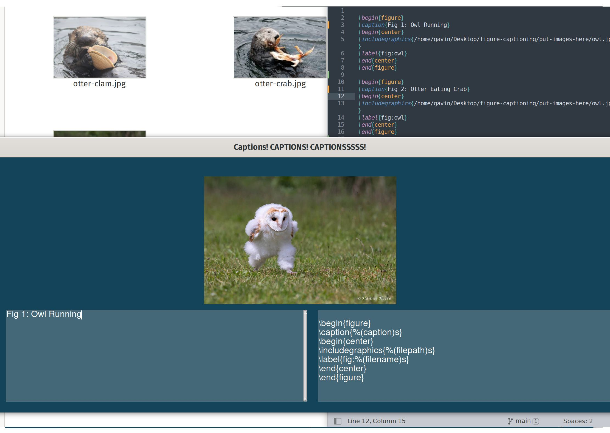

# "How can I caption and template a folder of images quickly in latex"

Quick tool 

There is a runnable binary at

```
dist/captioner

```

Alternatively you can run the python script by installing the prerequisites and running it with

```
python3 -m pip install pysimplegui
python3 captioner.py

```

Assuming python3 is installed
# Build

Builds into a binary with pyinstaller

```
pyinstaller --onefile captioner.py

```

# Usage

Has a gui. Right hand pane is the template to use. It has three variables: caption, filepath, filename (without extension)

Left hand pane is the caption. 



hit enter or click add to skip to the next image